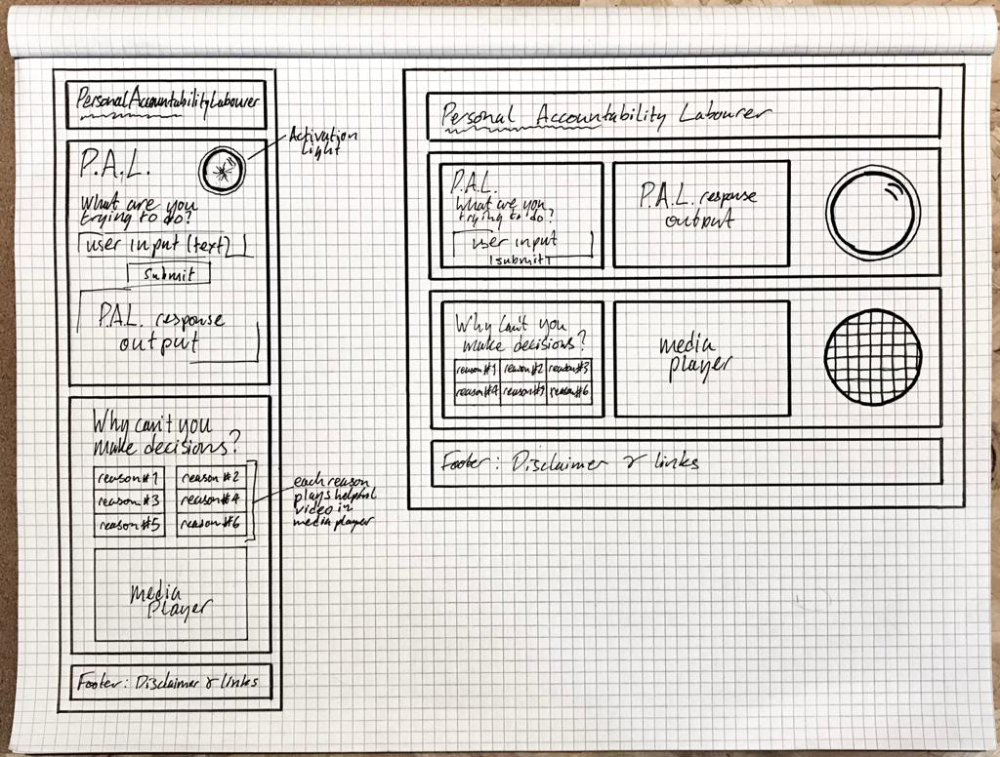
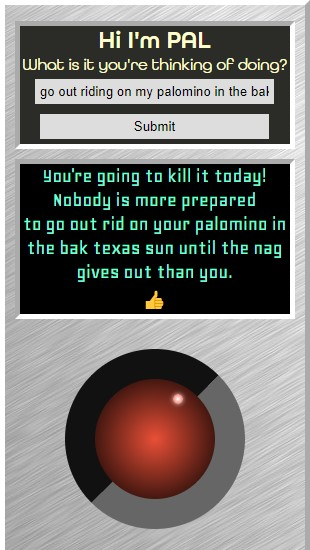

# P.A.L. 🤖
P.A.L. is for the disenfranchised and disempowered. P.A.L. will make small life choices for you in the hope that the resources P.A.L. provides will help you to empower yourself. P.A.L.'s first module makes the decision for you and the second will provide you with a resource related to personal accountability/empowerment.

I want P.A.L. to displace the user's nihilism so that P.A.L. can help them to focus on empowering themselves.

## Strategy
P.A.L. is intended to empower by temporarily displacing personal accountability and providing resources to those who need to redirect their potential.

## Scope
P.A.L. will allow the users to indulge in a chance-based evaluation of their potential failure or success at a task submitted by the user. P.A.L. is therefore an arbitrary guidance counsellor.

## Structure
P.A.L. is the first and only element you can interact with on the site. He will then provide third party resources to enable the user to re-approach decision-making for themselves.

## Skeleton
P.A.L. will appear centrally on the homepage but there will be a resources page and about section on the site to explain the philosophy of P.A.L. and also a disclaimer recommending against using P.A.L. for serious personal use.

## Wireframes

*N.B. pdf available in: /assets/images*

## Bugs
* Module 1 'What are you thinking of doing?'
    * Although the text input field is prepopulated with 'I'm trying to...' (in order to force the syntax of the user input) if the user inserts a present participle verb (havING, chargING) where the verb would usually end in 'e', P.A.L. won't append the 'e'. The output for these two examples is therefore 'hav' and 'charg' respectively.
    * The longer the string, the more opportunity there is for the conjugation to break the function: 
    
    

    * ~~IOS device clicks don't trigger the P.A.L. lamp on/off~~ SOLVED: changed lamp trigger to 'submit' event instead of 'mousedown'/'mouseup' events.

* Module 2 'Dr P.A.L.'
    * Playing a video shows the credit for that video in the vid-credit panel however clicking on a video button whilst another video is playing replaced the credit with the placeholder text and continues to play the original video.

## Out of scope/future features
* full screen video from Module 2
* log and filter responses from Module 1 so that you don't recieve the same result twice
## Testing 
* jshint - returns fully validated JS

## Credits
* Adobe fonts

## Acknowledgements